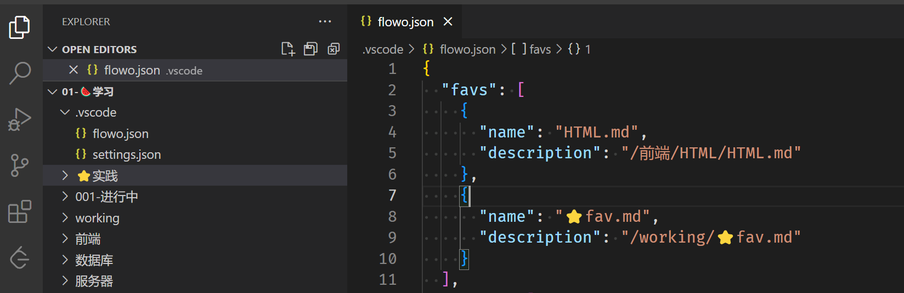
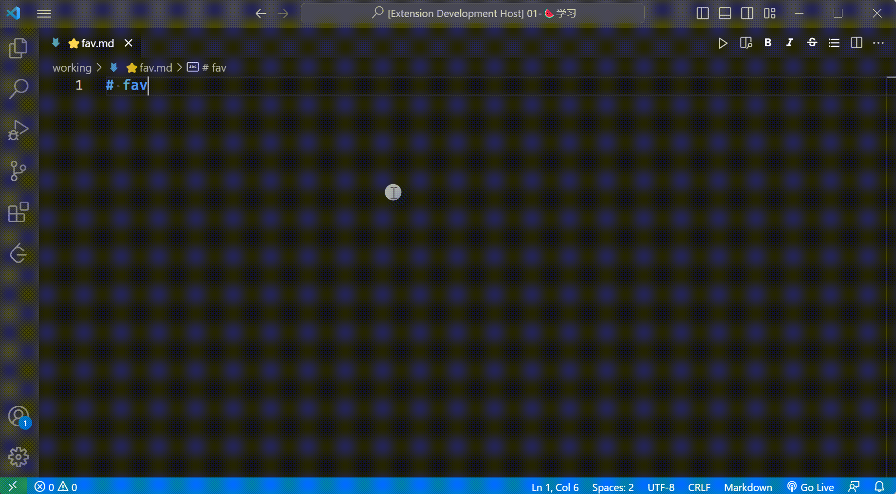
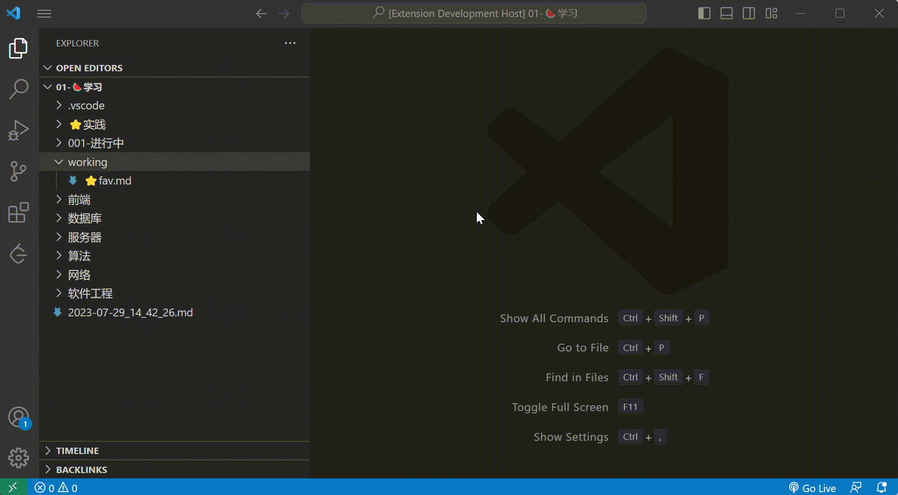
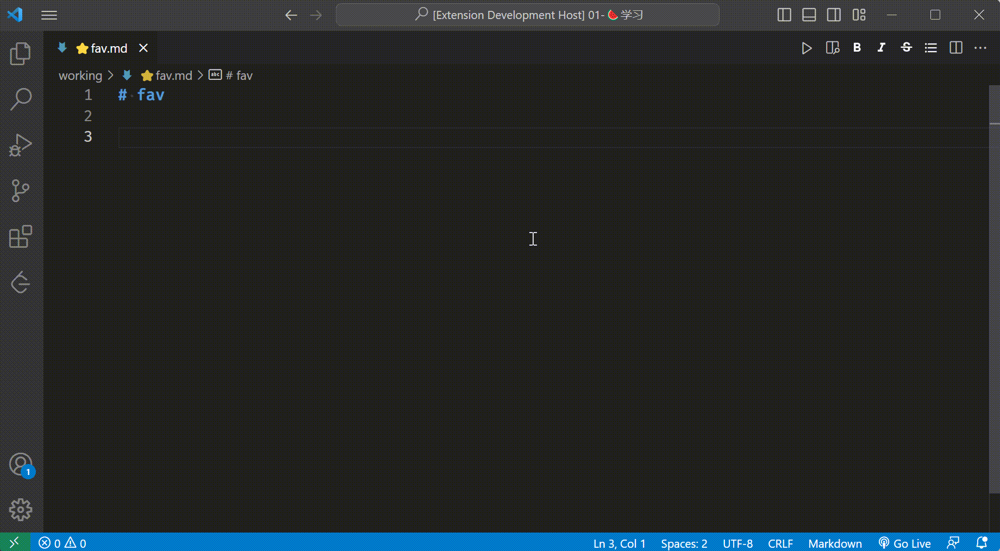
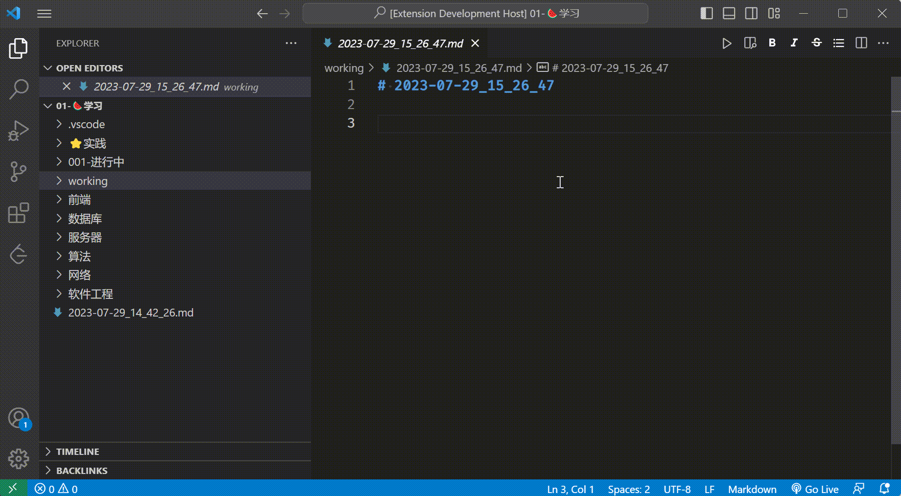

# README

> "Flowo" means flow all, hope it can make you easy get in to flow when you writting 

I have used "**Obsidian**" for keeping my **PKM** (Personal Knowledge Management), but when I use it, I feel that it is difficult for me to enter the `Zen` state, so inspired by "Obsidian", I wrote this small tool is `simple` but `sufficient`


**Enjoy!**

## Features

**Flowo** will create `/.vscode/flowo.json` file under workspace root folder

You can edit it by yourself (see [#flowo.json](#flowojson))



### Bookmark

1. Add new bookmark `Flowo: New Favorite`
   1. add current activated Tab as bookmark
2. pick bookmark to open `Flowo: Favorite`



### New markdown

Quick create a markdown file at default path
your can set in `/.vscode/flowo.json` `.favs`

1. pick path
2. input file name
   1. if empty ,use current time for file name
   2. not input `.md`

command: `Flowo: New Markdown`



### Insert plate

Insert predefine plate. how to use it's up to you!!!

- It can be use like snippets
  - 5w1h
  - kpt
  - swot
  - planlist

- lifeTime
  - set birthday in flowo.json
    - `"birthday": "1970-01-01"`


command: `Flowo: Insert Plate`



### Open random file

Discover a little surprise

command: `Flowo: Try Your Luck`




### flowo.json

> !!! json not support annotation

```json

{
  // bookmark
  // use command 'Flowo: New Favorite' add
  "favs": [
    {
      "name": "HTML.md",
      "description": "/前端/HTML/HTML.md"
    },
    {
      "name": "⭐fav.md",
      "description": "/working/⭐fav.md"
    }
  ],
  // new markdown path
  // support two type , and if only one path will be default,jump pick step 
  "paths": [
    // String: relativePath
    "/",
    // name: shortName
    // description: relativePath 
    {
      "name": "work",
      "description": "/working"
    }
  ],
  "birthday": "1970-01-01",
  // insert plate
  // support two type, you can set it for everywhere
  "inserts": [
    // String: simple tag
    "#FE ",
    "#FE/CSS ",
    "#FE/JS/Array ",
    "#Software ",
    "#Software/docker ",
    "@where ",
    "@who ",
    "v1.0.0",
    "v1.1.3",
    // name: shortName
    // description: template 
    {
      "name": "kpt",
      "description": "- KEEP\n- PROBLEM\n- TRY\n"
    },
    {
      "name": "how to read book",
      "description": "- what i want to get\n- what can i use it for\n- Keys\n"
    }
  ]
}

```


## Release Notes

### 1.0.0

Initial release 

